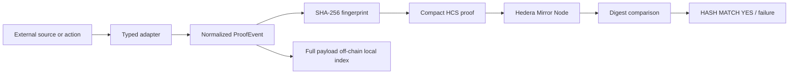
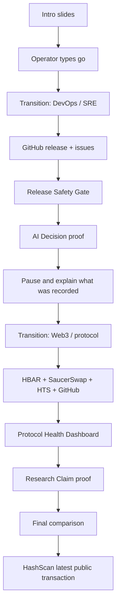
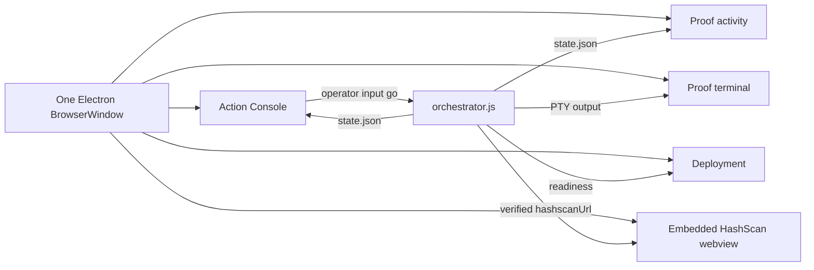

# Tracemark Control Room Architecture

## Product data graph



## Two-scenario film graph



## Electron window roles



## Role definitions

### Action Console

The operator-facing narrative surface. It must say what scenario is beginning, what the system will read, what it will record, and when the scenario is complete. It owns the `go` input and the short transitions between phases.

### Deployment

Only local readiness: hidden Next.js server, API doctor response, template/process status. It must not pretend to be a proof result.

### Proof

Technical pipeline: source fetch, normalized event type, digest, HCS submission, sequence number, Mirror read-back, digest comparison.

### Proof activity

Audience-friendly state summary. It must show the active scenario and the current record/stage, not duplicate generic terminal prose. The target stage list is:

```text
read → normalize → hash → write to HCS → check
```

### HashScan

The official public Hedera evidence page inside the existing Electron `<webview>`. It must receive the latest verified transaction URL and must not open an external browser automatically.

## State contract needed by the visible UI

The current orchestrator writes fields such as:

```text
stage
scenario
status
active
comment
source
proofs[]
sequence
hashMatch
hashscanUrl
```

The renderer must map these to human-visible content:

```text
scenario title
scenario explanation
current action
what was recorded
current proof stage
latest public reference
success/failure state
```

The current defect is that the state contract exists in the backend, but the renderer does not yet turn it into a sufficiently specific audience narrative.
